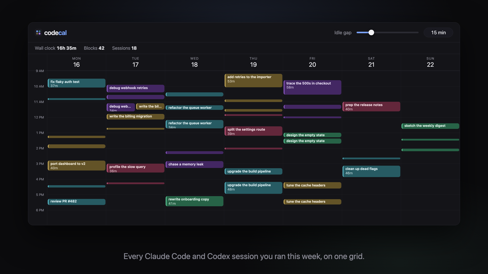
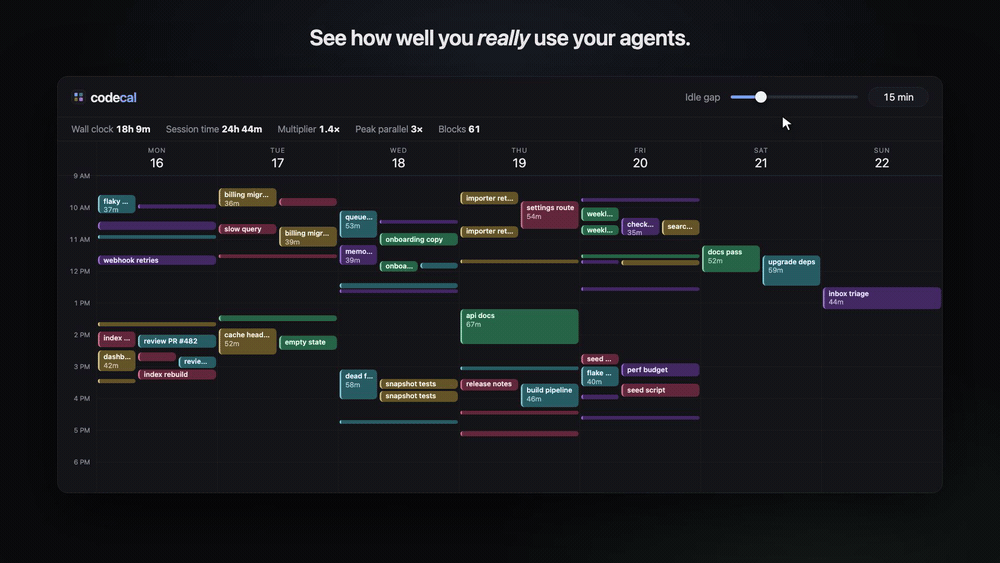

<p align="center">
  
</p>

<h1 align="center">codecal</h1>

<p align="center">
  <b>Your coding agents, on a calendar.</b><br />
  Every Claude Code and Codex session you ran on this machine, drawn hour by hour.
</p>

<p align="center">
  <code>npx github:awlevin/codecal</code>
</p>

<p align="center">
  
  
  
  
</p>

<p align="center"><a href="assets/codecal-demo.mp4">▶ Watch the 20-second demo</a></p>

---

## Setup is the whole command

```bash
npx github:awlevin/codecal
```

It serves <http://localhost:4317> and opens it. No install, no build step, no config file, no account, no dependencies. Node 18 or newer is the only requirement.

## Why

Claude Code and Codex already write a full transcript of every session to disk, in `~/.claude/projects/` and `~/.codex/sessions/`. The data to answer "when did I actually work today, and on what" is already on your machine. codecal draws it.

- When did I really start, and when did I really stop?
- How much of yesterday was three agents running at once?
- Which repo ate Tuesday?
- Am I spending more time in Claude Code or in Codex?
- What was that session on Thursday afternoon, and how do I resume it?

Everything is read locally. Nothing is uploaded, and no transcript content leaves the machine.

## The idle gap

<p align="center">
  
</p>

A session is a stream of events, not a solid block. Read a diff for ten minutes before replying and the transcript has a ten minute hole that was really one continuous stretch of work. Draw it literally and your week turns into confetti.

The **idle gap** slider sets how long a pause must be before one block breaks in two. Drag it and the calendar re-merges live.

| Idle gap | Blocks | Wall clock |
| --- | --- | --- |
| 1 min | 314 | 13h 29m |
| 15 min (default) | 171 | 19h 47m |
| 120 min | 41 | 72h 02m |

Low values show individual turns. High values show "I had an agent open all evening". Fifteen minutes is a good middle, and the setting is remembered per browser.

## What you get

|  |  |
| --- | --- |
| **Week view** | Seven days by hour, with a live now-line and a red marker on today |
| **A block per stretch of work** | Colored by repo and worktree, side by side when sessions overlap, widening into free space |
| **Both agents** | Claude Code solid, Codex striped, header toggles to show either alone |
| **Two totals** | Wall clock counts overlapping sessions once. Session time sums every block. On a day of parallel agents the second is far larger |
| **Session detail** | Span, prompts, assistant turns, models, tokens, every block in the session, the transcript path, and a ready-to-paste resume command |
| **Hide the noise** | A session that hung on an unanswered prompt for three days can be hidden in one click, and brought back with a toggle |
| **Live refresh** | The index rebuilds every 30 seconds, so a session you start while the page is open appears on its own |

## Controls

| Control | What it does |
| --- | --- |
| `Today`, `‹`, `›`, `←`, `→`, `T` | Move between weeks |
| Idle gap slider | Live re-merge of blocks |
| Subagents toggle | Count subagent runtime as session runtime |
| Claude / Codex toggles | Show one source or both |
| Hidden toggle | Bring hidden sessions back, drawn muted |
| Projects menu | Show or hide individual repos and worktrees |
| Click a block | Open the session detail panel |
| `Esc` | Close the detail panel |

## Options

```bash
npx github:awlevin/codecal --port 5000   # serve somewhere else
npx github:awlevin/codecal --no-open     # do not open a browser
npx github:awlevin/codecal --no-codex    # Claude Code only
npx github:awlevin/codecal --no-claude   # Codex only
npx github:awlevin/codecal --no-cache    # force a full re-read
npx github:awlevin/codecal --help
```

Run it from a clone instead:

```bash
git clone https://github.com/awlevin/codecal.git
cd codecal
node bin/codecal.mjs
```

## How it reads your transcripts

| Source | Read from | Becomes |
| --- | --- | --- |
| Claude Code | `~/.claude/projects/**/<session>.jsonl` | An activity point per timestamped record |
| Claude Code | `turn_duration` records | A real span, so one long tool call still reads as runtime |
| Claude Code | `<session>/subagents/*.jsonl` | Subagent runtime, credited to the parent session |
| Codex | `~/.codex/sessions/**` and `~/.codex/archived_sessions/**` | An activity point per rollout record |
| Codex | `session_meta`, `turn_context`, `event_msg` | Working directory, model, prompts, token totals |
| Both | Session title, else the first typed prompt | The block label |
| Both | Working directory | The project color, worktrees included |

Points and spans are fused into intervals at index time, then merged into blocks in the browser at whatever idle gap you pick.

The largest records carry bytes rather than metadata, so they are read for their timestamp alone, and every file is cached in `~/.cache/codecal/` by size and mtime. A cold pass over ~2.5 GB of transcripts takes about ten seconds. After that a re-index is well under a second, since only changed files are re-read.

## What it cannot see

ChatGPT web conversations. Those live on OpenAI's servers, not on your disk, so there is nothing local to read. Only the Codex CLI and Codex Desktop write rollouts locally, and those are what this reads.

Transcript formats change between releases of both tools. If a week looks empty or wrong, the format probably moved. Open an issue with your Claude Code or Codex version.

## The demo video

`demo/` holds the [Remotion](https://www.remotion.dev/) project that renders the video and the hero image at the top. Its sessions are synthetic, so no real work shows up in them.

```bash
cd demo
npm install
npx remotion studio          # edit it live
npx remotion render Demo     # out/codecal-demo.mp4
```

## License

MIT
